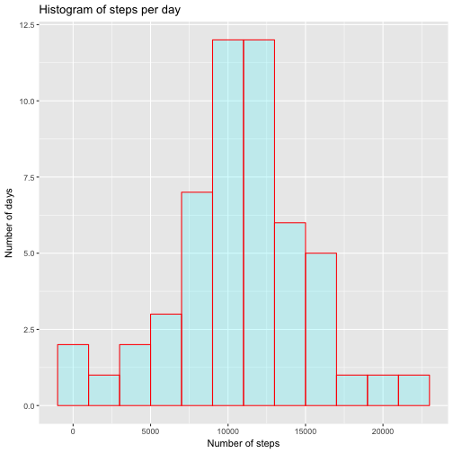

#Reproducible Research: Assignment 1


Download, unzip, and read data

```r
fileUrl <- "https://d396qusza40orc.cloudfront.net/repdata%2Fdata%2Factivity.zip"
library(downloader)
download(fileUrl, dest="activity.zip", mode="wb") 
unzip("activity.zip")
activity <- read.csv("activity.csv")
```

Total number of steps per day 

```r
#load packages
library(ggplot2)
library(magrittr)
library(plyr)
library(dplyr)

#create new data frame of steps per day
steps_per_day <- data.frame(group_by(activity, date) %>% summarize(steps = sum(steps)))

#create histogram
qplot(steps_per_day$steps, geom = "histogram", main = "Histogram of steps per day",
      binwidth = 2000,
      xlab = "Number of steps", ylab = "Number of days",
      fill = I("turquoise1"), col = I("red"), alpha = I(.2))
```



```r
#mean and median steps per day
mean(steps_per_day$steps, na.rm = TRUE)
```

```
## [1] 10766.19
```

```r
median(steps_per_day$steps, na.rm = TRUE)
```

```
## [1] 10765
```

Average daily activity pattern

```r
#create new data frame of average steps by 5-minute interval
interval <- data.frame(group_by(activity, interval) %>% 
        summarize(avg_steps = mean(steps, na.rm = TRUE)))

#create time series plots
qplot(interval, avg_steps, data = interval, geom = "line", col = I("navyblue"),
      main = "Average number of steps by time of day",
      xlab = "5 minute interval", ylab = "Average steps")
```


```r
#find interval with maximum steps
interval[which.max(interval$avg_steps),]
```

```
##     interval avg_steps
## 104      835  206.1698
```

Imputing missing values

```r
#calculate total number of missing values
sum(is.na(activity$steps))
```

```
## [1] 2304
```

```r
#impute.mean function
impute.mean <- function(x) replace(x, is.na(x) | is.nan(x) | is.infinite(x),
                                   mean(x, na.rm = TRUE))

#create new dataset with imputed missing values, using mean steps for 5-minute interval
activity_imputed <- activity
activity_imputed <- ddply(activity_imputed, ~interval, transform, 
                          steps = impute.mean(steps))
```

Total steps per day with imputed values

```r
#create new data frame of steps per day with imputed values
steps_per_day_imputed <- data.frame(group_by(activity_imputed, date) %>% 
                                            summarize(steps = sum(steps)))

#create histogram with imputed values
qplot(steps_per_day_imputed$steps, geom = "histogram",
      main = "Histogram of steps per day with imputed values",
      binwidth = 2000,
      xlab = "Number of steps", ylab = "Number of days",
      fill = I("gold3"), col = I("red"), alpha =
              I(.5))
```


```r
#mean and median steps per day with imputed values
mean(steps_per_day_imputed$steps)
```

```
## [1] 10766.19
```

```r
median(steps_per_day_imputed$steps)
```

```
## [1] 10766.19
```

Activity patterns on weekdays vs. weekends

```r
#change date variable from factor to date
activity_imputed$date <- as.Date(activity_imputed$date)

#create weekday/weekend factor variable
activity_imputed$week <- ifelse(weekdays(activity_imputed$date) %in% c("Saturday", "Sunday"), 
                        "Weekend","Weekday")

#create data frame of average steps by 5-minute interval by weekday/weekend
interval_weekday <- data.frame(group_by(activity_imputed, interval, week) %>% 
        summarize(avg_steps = mean(steps)))

#create time series plots for weekday and weekend steps by interval
ggplot(interval_weekday, aes(interval, avg_steps, color = factor(week))) +
        geom_line() + facet_grid(. ~ week) +
        labs(title = "Average number of steps by time of day",
        x = "5 minute interval", y = "Average steps") +
        scale_color_manual(values = c("darkmagenta", "red4")) +
        theme(legend.position = "none")
```


